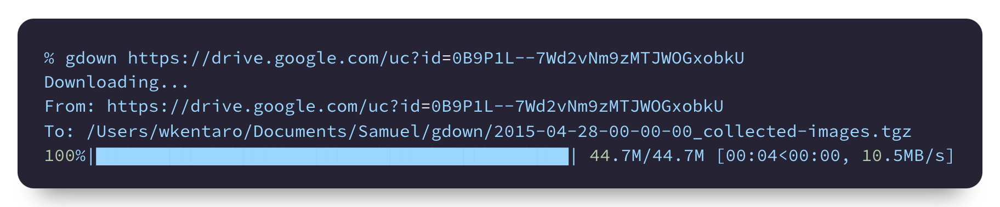
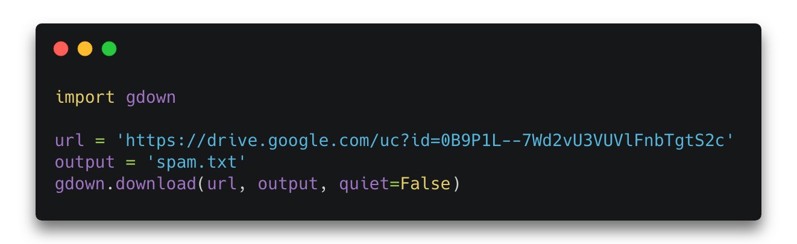

<h1 align="center">
  gdown
</h1>

<h4 align="center">
  Download a large file from Google Drive.
</h4>

<div align="center">
  <a href="https://pypi.python.org/pypi/gdown"></a>
  <a href="https://pypi.org/project/gdown"></a>
  <a href="https://github.com/wkentaro/gdown/actions"></a>
</div>

<div align="center">
  
  
</div>

<br/>


## Description

Download a large file from Google Drive.  
If you use curl/wget, it fails with a large file because of
the security warning from Google Drive.


## Installation

```bash
pip install gdown
```


## Usage

### From Command Line

```bash
$ gdown --help
usage: gdown [-h] [-V] [-O OUTPUT] [-q] [--id] [--folder] [--proxy PROXY] [--speed SPEED]
             [--no-cookies]
             url_or_id
...

$ # a large file (~400MB)
$ gdown https://drive.google.com/uc?id=0B_NiLAzvehC9R2stRmQyM3ZiVjQ
$ # gdown --id 0B_NiLAzvehC9R2stRmQyM3ZiVjQ
$ md5sum pose_estimation_2d_chainermodel.pkl
587933c2c0adf335ebed0486c183541f

$ # a small file
$ gdown https://drive.google.com/uc?id=0B9P1L--7Wd2vU3VUVlFnbTgtS2c
$ cat spam.txt
spam

$ # a folder
$ gdown https://drive.google.com/drive/folders/1ivUsJd88C8rl4UpqpxIcdI5YLmRD0Mfj -O /temp/folder --folder

$ # as an alternative to curl/wget
$ gdown https://httpbin.org/ip -O ip.json
$ cat ip.json
{
  "origin": "126.169.213.247"
}

$ # write stdout and pipe to extract
$ gdown https://drive.google.com/uc?id=0B9P1L--7Wd2vNm9zMTJWOGxobkU -O - --quiet | tar zxvf -
$ ls 20150428_collected_images/

$ # it can handle urls created from [Share] -> [Copy Url] on Google Drive
$ gdown 'https://drive.google.com/a/jsk.imi.i.u-tokyo.ac.jp/uc?id=0B_NiLAzvehC9R2stRmQyM3ZiVjQ'
```

### From Python

```python
import gdown

url = 'https://drive.google.com/uc?id=0B9P1L--7Wd2vNm9zMTJWOGxobkU'
output = '20150428_collected_images.tgz'
gdown.download(url, output, quiet=False)

md5 = 'fa837a88f0c40c513d975104edf3da17'
gdown.cached_download(url, output, md5=md5, postprocess=gdown.extractall)

url = 'https://drive.google.com/drive/folders/1ivUsJd88C8rl4UpqpxIcdI5YLmRD0Mfj'
gdown.download_folder(url, quiet=True, no_cookies=True)
```


## License

See [LICENSE](LICENSE).
